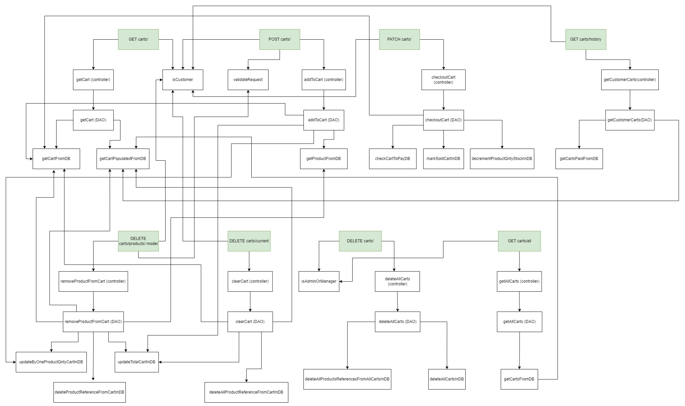

# Test Report

<The goal of this document is to explain how the application was tested, detailing how the test cases were defined and what they cover>

# Contents

- [Test Report](#test-report)
- [Contents](#contents)
- [Dependency graph](#dependency-graph)
- [Integration approach](#Integration-approach)
- [Tests](#tests)
- [Coverage](#coverage)
  - [Coverage of FR](#coverage-of-fr)
  - [Coverage White box](#coverage-White-box)

# Dependency graph

  ## High level dependencies
  

  ## Dependencies for Users
  

  ## Dependencies for Products
  

  ## Dependencies for Carts
  

  ## Dependencies for Reviews
  

# Integration approach

  ## Authentication tests
  Bottom up approach: 
  Step 1: Routes unit tests, step 2: API calls integration tests

  ## Users tests
  Bottom up approach: 
  Step 1: UserRoutes unit tests, step 2: UserController unit tests, step 3: UserDAO unit tests, step 4: API calls integration tests

  ## Products tests
  Bottom up approach: 
  Step 1: ProductDAO unit tests, step 2: ProductController unit tests, step 3: ProductRoutes unit tests, step 4: API calls integration tests

  ## Reviews tests
  Bottom up approach: 
  Step 1: ReviewDAO unit tests, step 2: ReviewController unit tests, step 3: ReviewRoutes unit tests, step 5 (after step 4 of Users and Products tests): API calls integration tests
  
  ## Carts tests
  Bottom up approach: 
  Step 1: CartDAO unit tests, step 2: CartController unit tests, step 3: CartRoutes unit tests, step 5 (after step 4 of Users and Products tests): API calls integration tests

# Tests

## Authentication
| Test case name | Object(s) tested | Test level | Technique used |
| :------------: | :--------------: | :--------: | :------------: |
| logs in a user |  POST ezelectronics/sessions                |  Unit          |  Boundary - White box              |
| empty username, should return 422 |  POST ezelectronics/sessions                |  Unit          |  Boundary - White box              |
| performs logout |  DELETE ezelectronics/sessions/current                |  Unit          |  Boundary - White box              |
| performs logout when not logged in |  DELETE ezelectronics/sessions/current                |  Unit          |  Boundary - White box              |
| successfully gets session |  GET ezelectronics/sessions/current                |  Unit          |  Boundary - White box              |
| fails because user is not loogged in |  GET ezelectronics/sessions/current                |  Unit          |  Boundary - White box              |
| It logs in the user |  POST ezelectronics/sessions/current                |  Integration         |  Black box              |
| Should return 401 when the username does not exist |  POST ezelectronics/sessions/current                |  Integration         |  Black box              |
| Should return 401 when the password does not match |  POST ezelectronics/sessions/current                |  Integration         |  Black box              |
| It retrieves info regarding the logged in user |  GET ezelectronics/sessions/current                |  Integration         |  Black box              |
| Should return 401 if the caller is not logged in |  GET ezelectronics/sessions/current                |  Integration         |  Black box              |
| successfully logs out |  DELETE ezelectronics/sessions/current                |  Integration         |  Black box              |
| Should return 401 when the user is not logged in |  DELETE ezelectronics/sessions/current                |  Integration         |  Black box              |

## User
| Test case name | Object(s) tested | Test level | Technique used |
| :------------: | :--------------: | :--------: | :------------: |
|  It should return It should return a 200 success code               |  POST ezelectronics/users                |  Unit          |  Boundary - White box              |
|  New user with not available username, should return 409 error code               |  POST ezelectronics/users                |  Unit          |  Boundary - White box              |
| len 1 username, status 200               |  POST ezelectronics/users                |  Unit          |  Boundary - White box              |
|  empty username, status 422               |  POST ezelectronics/users                |  Unit          |  Boundary - White box              |
|  empty name, status 422               |  POST ezelectronics/users                |  Unit          |  Boundary - White box              |
|  len1 name, status 200               |  POST ezelectronics/users                |  Unit          |  Boundary - White box              |
|  empty surname, status 422               |  POST ezelectronics/users                |  Unit          |  Boundary - White box              |
|  len1 surname, status 200               |  POST ezelectronics/users                |  Unit          |  Boundary - White box              |
|  empty password, status 422               |  POST ezelectronics/users                |  Unit          |  Boundary - White box              |
|  len1 password, status 200               |  POST ezelectronics/users                |  Unit          |  Boundary - White box              |
|  empty role, status 422               |  POST ezelectronics/users                |  Unit          |  Boundary - White box              |
| It returns an array of users              |  GET ezelectronics/users                |  Unit          |  Boundary - White box              |
| Returns an empty array              |  GET ezelectronics/users                |  Unit          |  Boundary - White box              |
| Returns an array with a single value              |  GET ezelectronics/users                |  Unit          |  Boundary - White box              |
| Returns a 401 error              |  GET ezelectronics/users                |  Unit          |  Boundary - White box              |
| it should return the list of admin users              |  GET ezelectronics/users/roles/:role                |  Unit          |  Boundary - White box              |
| it should return the list with a single admin              |  GET ezelectronics/users/roles/:role                |  Unit          |  Boundary - White box              |
| it should return an empty list              |  GET ezelectronics/users/roles/:role                |  Unit          |  Boundary - White box              |
| it should return a 401 error              |  GET ezelectronics/users/roles/:role                |  Unit          |  Boundary - White box              |
| it should return a 422 error, invalid role              |  GET ezelectronics/users/roles/:role                |  Unit          |  Boundary - White box              |
| should return the specified user         |  GET ezelectronics/users/:username                |  Unit          |  Boundary - White box              |
| should return 404 id the user does not exist|  GET ezelectronics/users/:username                |  Unit          |  Boundary - White box              |
| user deletes themselves |  DELETE ezelectronics/users/:username                |  Unit          |  Boundary - White box              |
| user attempts to delete admin, unauthorized |  DELETE ezelectronics/users/:username                |  Unit          |  Boundary - White box              |
| delete all users |  DELETE ezelectronics/users                |  Unit          |  Boundary - White box              |
| non admin attempts to delete all users |  DELETE ezelectronics/users                |  Unit          |  Boundary - White box              |
| should update the specified user |  PATCH ezelectronics/users/:username                |  Unit          |  Boundary - White box              |
| Birthdate is in the future, should return 400 |  PATCH ezelectronics/users/:username                |  Unit          |  Boundary - White box              |
| User not logged in, should return 401 |  PATCH ezelectronics/users/:username                |  Unit          |  Boundary - White box              |
| Invalid body fields, should return 422 |  PATCH ezelectronics/users/:username                |  Unit          |  Boundary - White box              |
| Admin attempts to update another admin, should return 401 |  PATCH ezelectronics/users/:username                |  Unit          |  Boundary - White box              |
| Non admin attempts to update another user |  PATCH ezelectronics/users/:username                |  Unit          |  Boundary - White box              |
| username already in use, it should return false |  UserController.createUser()               |  Unit          |  Boundary - White box              |
| It should return true |  UserController.createUser()               |  Unit          |  Boundary - White box              |
| empty username, should return false |  UserController.createUser()               |  Unit          |  Boundary - White box              |
| len 1 username, should return true |  UserController.createUser()               |  Unit          |  Boundary - White box              |
| empty name, should return false |  UserController.createUser()               |  Unit          |  Boundary - White box              |
| len 1 name, should return true |  UserController.createUser()               |  Unit          |  Boundary - White box              |
| empty surname, should return false |  UserController.createUser()               |  Unit          |  Boundary - White box              |
| len 1 surname, should return true |  UserController.createUser()               |  Unit          |  Boundary - White box              |
| empty password, should return false |  UserController.createUser()               |  Unit          |  Boundary - White box              |
| len1 password, should return true |  UserController.createUser()               |  Unit          |  Boundary - White box              |
| invalid role, should return false |  UserController.createUser()               |  Unit          |  Boundary - White box              |
| empty role, should return false |  UserController.createUser()               |  Unit          |  Boundary - White box              |
| Should return list of users |  UserController.getUsers()               |  Unit          |  Boundary - White box              |
| Should return a single user |  UserController.getUsers()               |  Unit          |  Boundary - White box              |
| Should return an empty list |  UserController.getUsers()               |  Unit          |  Boundary - White box              |
| Should return admin list |  UserController.getUsersByRole()               |  Unit          |  Boundary - White box              |
| Should return single admin |  UserController.getUsersByRole()               |  Unit          |  Boundary - White box              |
| Should return no admin |  UserController.getUsersByRole()               |  Unit          |  Boundary - White box              |
| Should return customer list |  UserController.getUsersByRole()               |  Unit          |  Boundary - White box              |
| Should return single customer |  UserController.getUsersByRole()               |  Unit          |  Boundary - White box              |
| Should return no customer |  UserController.getUsersByRole()               |  Unit          |  Boundary - White box              |
| Should return manager list |  UserController.getUsersByRole()               |  Unit          |  Boundary - White box              |
| Should return single manager |  UserController.getUsersByRole()               |  Unit          |  Boundary - White box              |
| Should return no manager |  UserController.getUsersByRole()               |  Unit          |  Boundary - White box              |
| empty role, should return empty list |  UserController.getUsersByRole()               |  Unit          |  Boundary - White box              |
| invalid role, should return empty list |  UserController.getUsersByRole()               |  Unit          |  Boundary - White box              |
| Admin retrieves an admin |  UserController.getUserByUsername()               |  Unit          |  Boundary - White box              |
| Admin retrieves a customer |  UserController.getUserByUsername()               |  Unit          |  Boundary - White box              |
| Admin retrieves a manager |  UserController.getUserByUsername()               |  Unit          |  Boundary - White box              |
| Admin retrieves themselves |  UserController.getUserByUsername()               |  Unit          |  Boundary - White box              |
| Admin attempts to retrieve invalid username, error |  UserController.getUserByUsername()               |  Unit          |  Boundary - White box              |
| Admin attempts to retrieve empty username, error |  UserController.getUserByUsername()               |  Unit          |  Boundary - White box              |
| Customer retrieves themselves |  UserController.getUserByUsername()               |  Unit          |  Boundary - White box              |
| Customer attempts to retrieve other user |  UserController.getUserByUsername()               |  Unit          |  Boundary - White box              |
| Manager retrieves themselves |  UserController.getUserByUsername()               |  Unit          |  Boundary - White box              |
| Manager attempts to retrieve other user |  UserController.getUserByUsername()               |  Unit          |  Boundary - White box              |
| Admin attempts to retrieve themselves but it is not in the db |  UserController.getUserByUsername()               |  Unit          |  Boundary - White box              |
| Customer attempts to retrieve themselves but it is not in the db |  UserController.getUserByUsername()               |  Unit          |  Boundary - White box              |
| Manager attempts to retrieve themselves but it is not in the db |  UserController.getUserByUsername()               |  Unit          |  Boundary - White box              |
| Admin deletes a Customer |  UserController.deleteUser()               |  Unit          |  Boundary - White box              |
| Admin deletes a Manager |  UserController.deleteUser()               |  Unit          |  Boundary - White box              |
| Admin deletes a themselves|  UserController.deleteUser()               |  Unit          |  Boundary - White box              |
| Customer deletes a themselves|  UserController.deleteUser()               |  Unit          |  Boundary - White box              |
| Customer attempts to delete other user|  UserController.deleteUser()               |  Unit          |  Boundary - White box              |
| Manager deletes themselves|  UserController.deleteUser()               |  Unit          |  Boundary - White box              |
| Manager attempts to delete other user|  UserController.deleteUser()               |  Unit          |  Boundary - White box              |
| Admin attempts to delete non existent user|  UserController.deleteUser()               |  Unit          |  Boundary - White box              |
| Admin attempts to delete another admin |  UserController.deleteUser()               |  Unit          |  Boundary - White box              |
| Manager attempts to delete other user|  UserController.deleteUser()               |  Unit          |  Boundary - White box              |
| delete all users|  UserController.deleteAll()               |  Unit          |  Boundary - White box              |
| delete all users fails |  UserController.deleteAll()               |  Unit          |  Boundary - White box              |
| Admin updates their info |  UserController.updateUserInfo()               |  Unit          |  Boundary - White box              |
| Customer updates their info |  UserController.updateUserInfo()               |  Unit          |  Boundary - White box              |
| Manager updates their info |  UserController.updateUserInfo()               |  Unit          |  Boundary - White box              |
| User attempts to update another user info |  UserController.updateUserInfo()               |  Unit          |  Boundary - White box              |
| Authenticated, should resolve to true |  UserDAO.getIsUserAuthenticated()               |  Unit          |  Boundary - White box              |
| empty username, should return an error |  UserDAO.getIsUserAuthenticated()               |  Unit          |  Boundary - White box              |
| should return false if the password does not match |  UserDAO.getIsUserAuthenticated()               |  Unit          |  Boundary - White box              |
| salt not in the db, should return false |  UserDAO.getIsUserAuthenticated()               |  Unit          |  Boundary - White box              |
| username not in the db, should return false |  UserDAO.getIsUserAuthenticated()               |  Unit          |  Boundary - White box              |
| It should resolve true |  UserDAO.createUser()               |  Unit          |  Boundary - White box              |
| username in use, should throw UserAlreadyExistsError |  UserDAO.createUser()               |  Unit          |  Boundary - White box              |
| db fault, should throw error |  UserDAO.createUser()               |  Unit          |  Boundary - White box              |
| should return the list of all users |  UserDAO.getUsers()               |  Unit          |  Boundary - White box              |
| db has no users, should return empty array |  UserDAO.getUsers()               |  Unit          |  Boundary - White box              |
| db has one user, should return an array with a single value |  UserDAO.getUsers()               |  Unit          |  Boundary - White box              |
| db error while getting all users |  UserDAO.getUsers()               |  Unit          |  Boundary - White box              |
| returns all users that have role manager |  UserDAO.getUsersByRole()               |  Unit          |  Boundary - White box              |
| returns all users that have role customer |  UserDAO.getUsersByRole()               |  Unit          |  Boundary - White box              |
| returns all users that have role admin |  UserDAO.getUsersByRole()               |  Unit          |  Boundary - White box              |
| role is not Admin, Customer or Manager, should return an empty list |  UserDAO.getUsersByRole()               |  Unit          |  Boundary - White box              |
| returns the specified user |  UserDAO.getUsersByRole()               |  Unit          |  Boundary - White box              |
| the specified user is not found, returns UserNotFoundError |  UserDAO.getUserByUsername()               |  Unit          |  Boundary - White box              |
| the specified user is empty, returns db error |  UserDAO.getUserByUsername()               |  Unit          |  Boundary - White box              |
| specified user is successfully deleted, promise returns true |  UserDAO.deleteUser()               |  Unit          |  Boundary - White box              |
| specified user does not exist, UserNotFoundError is thrown |  UserDAO.deleteUser()               |  Unit          |  Boundary - White box              |
| empty username, db error |  UserDAO.deleteUser()               |  Unit          |  Boundary - White box              |
| successfully deletes all uses from database, promise resolves to true |  UserDAO.deleteAll()               |  Unit          |  Boundary - White box              |
| error deleting users, throws db error |  UserDAO.deleteAll()               |  Unit          |  Boundary - White box              |
| successfully updates info, returns updated User as a promise |  UserDAO.updateUserInfo()               |  Unit          |  Boundary - White box              |
| user does not exist, throws UserNotFoundError |  UserDAO.updateUserInfo()               |  Unit          |  Boundary - White box              |
| empty username, throws DB error |  UserDAO.updateUserInfo()               |  Unit          |  Boundary - White box              |
| empty name, throws DB error |  UserDAO.updateUserInfo()               |  Unit          |  Boundary - White box              |
| empty surname, throws DB error |  UserDAO.updateUserInfo()               |  Unit          |  Boundary - White box              |
| error while selecting the updated user, throws DB error |  UserDAO.updateUserInfo()               |  Unit          |  Boundary - White box              |
| It should return a 200 success code and create a new user | POST ezelectronics/users               |  Integration          |  Black box              |
| It should return a 422 error code if at least one request body parameter is empty/missing | POST ezelectronics/users               |  Integration          |  Black box              |
| It should return a 409 is the user is already in the database | POST ezelectronics/users               |  Integration          |  Black box              |
| It should return an array of users | GET ezelectronics/users               |  Integration          |  Black box              |
| It should return a 401 error code if the user is not an Admin | GET ezelectronics/users               |  Integration          |  Black box              |
| It should return an array of users with a specific role | GET ezelectronics/users/roles/:role               |  Integration          |  Black box              |
| It should fail if the role is not valid | GET ezelectronics/users/roles/:role               |  Integration          |  Black box              |
| It should return the specified user | GET ezelectronics/users/:username               |  Integration          |  Black box              |
| It should return error 404 | GET ezelectronics/users/:username               |  Integration          |  Black box              |
| It should return error 401 | GET ezelectronics/users/:username               |  Integration          |  Black box              |
| Should update the specified user | PATCH ezelectronics/users/:username               |  Integration          |  Black box              |
| Should return 400 when birthdate is after the current date | PATCH ezelectronics/users/:username               |  Integration          |  Black box              |
| Should return 404 when patching a non existing user | PATCH ezelectronics/users/:username               |  Integration          |  Black box              |
| It should delete the specified user | DELETE ezelectronics/users/:username               |  Integration          |  Black box              |
| It should return 404 | DELETE ezelectronics/users/:username               |  Integration          |  Black box              |
| It should return 401 when non admin attempts to delete other user | DELETE ezelectronics/users/:username               |  Integration          |  Black box              |
| It should return 401 when admin attempts to delete another admin | DELETE ezelectronics/users/:username               |  Integration          |  Black box              |
| It successfully deletes all non-admin user | DELETE ezelectronics/users               |  Integration          |  Black box              |
| It should return 401 when the caller isn't an admin | DELETE ezelectronics/users               |  Integration          |  Black box              |

## Products
| Test case name | Object(s) tested | Test level | Technique used |
| :------------: | :--------------: | :--------: | :------------: |
| It should return a 200 success code | **ProductRoute** POST /products | Unit | Boundary - White Box |
| It should return a 409 error code   | **ProductRoute** POST /products | Unit | Boundary - White Box |
| it Should return true | ProductController.registerProducts | Unit | Boundary - White Box |
| It should resolve true | ProductDAO.registerProducts | Unit | Boundary - White Box |
| It should reject with ProductAlreadyExistsError if the model already exists  |  ProductDAO.registerProducts  | Unit | Boundary - White Box |
| It should reject with an error if the category is invalid|  ProductDAO.registerProducts  | Unit | Boundary - White Box |
| It should reject with an error if the quantity is negative   |  ProductDAO.registerProducts  | Unit | Boundary - White Box |
| It should reject with an error if the sellingPrice is negative |  ProductDAO.registerProducts  | Unit | Boundary - White Box |
| It should reject with DateError if the arrivalDate is in the future  |  ProductDAO.registerProducts  | Unit | Boundary - White Box |
| It should set arrivalDate to current date if null |  ProductDAO.registerProducts  | Unit | Boundary - White Box |
| It should reject with error if there is a database error |  ProductDAO.registerProducts  | Unit | Boundary - White Box |
| It should resolve true with null details |  ProductDAO.registerProducts  | Unit | Boundary - White Box |
| It should set arrivalDate to current date if arrivalDate is null |  ProductDAO.registerProducts  | Unit | Boundary - White Box |
| It should handle database insertion failure |  ProductDAO.registerProducts  | Unit | Boundary - White Box |
| It should return a 200 success code | **ProductRoute** PATCH /products/:model | Unit | Boundary - White Box |
| It should return a 404 error code   | **ProductRoute** PATCH /products/:model | Unit | Boundary - White Box |
| it Should return quantity  | **ProductController**.changeProductQuantity | Unit | Boundary - White Box |
| it should resolve with the new total amount of products  | **ProductDAO**.changeProductQuantity | Unit | Boundary - White Box |
| It should reject with ProductNotFoundError if the product is not found  | **ProductDAO**.changeProductQuantity | Unit | Boundary - White Box |
| It should reject with an error if the new quantity is negative  | **ProductDAO**.changeProductQuantity | Unit | Boundary - White Box |
| It should reject with DateError if the changeDate is in the future | **ProductDAO**.changeProductQuantity | Unit | Boundary - White Box |
| It should set changeDate to current date if null | **ProductDAO**.changeProductQuantity | Unit | Boundary - White Box |
| It should reject with error if there is a database error during the select | **ProductDAO**.changeProductQuantity | Unit | Boundary - White Box |
| It should reject with error if there is a database error during the update | **ProductDAO**.changeProductQuantity | Unit | Boundary - White Box |
| It should reject with DateError if the changeDate is before the current arrivalDate | **ProductDAO**.changeProductQuantity | Unit | Boundary - White Box |
| It should reject with ProductNotFoundError if model does not exist | **ProductDAO**.changeProductQuantity | Unit | Boundary - White Box |
| It should handle zero quantity change | **ProductDAO**.changeProductQuantity | Unit | Boundary - White Box |
| It should handle database update failure | **ProductDAO**.changeProductQuantity | Unit | Boundary - White Box |
| It should return a 200 success code |  **ProductRoute** PATCH /products/:model/sell | Unit | Boundary - White Box |
| It should return a 404 error code | **ProductRoute** PATCH /products/:model/sell | Unit | Boundary - White Box |
| It should return a 409 error code | **ProductRoute** PATCH /products/:model/sell | Unit | Boundary - White Box |
| it Should return true | **ProductController**.sellProduct | Unit | Boundary - White Box |
| It should resolve true when the product is successfully sold | **ProductDAO**.sellProduct | Unit | Boundary - White Box |
| It should reject with ProductNotFoundError if the product is not found | **ProductDAO**.sellProduct | Unit | Boundary - White Box |
| It should reject with EmptyProductStockError if the product is out of stock | **ProductDAO**.sellProduct | Unit | Boundary - White Box |
| It should reject with LowProductStockError if the quantity in stock is lower than the amount requested | **ProductDAO**.sellProduct | Unit | Boundary - White Box |
| It should reject with DateError if the sellingDate is in the future | **ProductDAO**.sellProduct | Unit | Boundary - White Box |
| It should set sellingDate to current date if null | **ProductDAO**.sellProduct | Unit | Boundary - White Box |
| It should reject with DateError if the sellingDate is before the arrivalDate | **ProductDAO**.sellProduct | Unit | Boundary - White Box |
| It should reject with error if there is a database error during the select | **ProductDAO**.sellProduct | Unit | Boundary - White Box |
| It should reject with error if there is a database error during the update | **ProductDAO**.sellProduct | Unit | Boundary - White Box |
| It should reject with EmptyProductStockError if product is out of stock | **ProductDAO**.sellProduct | Unit | Boundary - White Box |
| It should reject with LowProductStockError if quantity in stock is lower than requested | **ProductDAO**.sellProduct | Unit | Boundary - White Box |
| It should handle database update failure during product sale | **ProductDAO**.sellProduct | Unit | Boundary - White Box |
| It should return all products when no query parameters are provided | **ProductRoute** GET /products | Unit | Boundary - White Box |
| It should return all products when no query parameters are provided | **ProductRoute** GET /products | Unit | Boundary - White Box |
| It should return products filtered by category | **ProductRoute** GET /products | Unit | Boundary - White Box |
| It should return products filtered by model | **ProductRoute** GET /products | Unit | Boundary - White Box |
| It should return 422 if grouping is null and category or model is not null | **ProductRoute** GET /products | Unit | Boundary - White Box |
| It should return 422 if grouping is category and category is null or model is not null | **ProductRoute** GET /products | Unit | Boundary - White Box |
| It should return 422 if grouping is model and model is null or category is not null | **ProductRoute** GET /products | Unit | Boundary - White Box |
| It should return 404 if model does not exist in database | **ProductRoute** GET /products | Unit | Boundary - White Box |
| It should return all available products when no query parameters are provided | **ProductRoute** GET /products/available | Unit | Boundary - White Box |
| It should return available products filtered by category | **ProductRoute** GET /products/available | Unit | Boundary - White Box |
| It should return available products filtered by model | **ProductRoute** GET /products/available | Unit | Boundary - White Box |
| It should return 422 if grouping is null and category or model is not null | **ProductRoute** GET /products/available | Unit | Boundary - White Box |
| It should return 422 if grouping is category and category is null or model is not null | **ProductRoute** GET /products/available | Unit | Boundary - White Box |
| It should return 422 if grouping is model and model is null or category is not null | **ProductRoute** GET /products/available | Unit | Boundary - White Box |
| it Should return the product Object | **ProductController**.getProducts | Unit | Boundary - White Box |
| it Should return the product Object | **ProductController**.getAvailableProducts | Unit | Boundary - White Box |
| It should resolve with all products when no grouping and no availability filter are provided | **ProductDAO**.getProducts | Unit | Boundary - White Box |
| It should resolve with available products of a specific category | **ProductDAO**.getProducts | Unit | Boundary - White Box |
| It should resolve with the specific model's available product | **ProductDAO**.getProducts | Unit | Boundary - White Box |
| It should reject with ProductNotFoundError if the model is not found | **ProductDAO**.getProducts | Unit | Boundary - White Box |
| It should reject with an error if an invalid category is provided | **ProductDAO**.getProducts | Unit | Boundary - White Box |
| It should reject with an error if a null category is provided | **ProductDAO**.getProducts | Unit | Boundary - White Box |
| It should reject with an error if there is a database error | **ProductDAO**.getProducts | Unit | Boundary - White Box |
| It should resolve with only available products when availability filter is true | **ProductDAO**.getProducts | Unit | Boundary - White Box |
| It should reject with an error if an invalid grouping is provided | **ProductDAO**.getProducts | Unit | Boundary - White Box |
| It should resolve with empty array if no products are found | **ProductDAO**.getProducts | Unit | Boundary - White Box |
| It should reject with an error if an invalid grouping is provided | **ProductDAO**.getProducts | Unit | Boundary - White Box |
| It should return a 200 success code | **ProductRoute** DELETE /products/ | Unit | Boundary - White Box |
| it Should return true | **ProductController**.deleteAllProducts | Unit | Boundary - White Box |
| it Should return false if no products were deleted | **ProductController**.deleteAllProducts | Unit | Boundary - White Box |
| It should resolve true when all products are successfully deleted | **ProductDAO**.deleteAllProducts | Unit | Boundary - White Box |
| It should reject with an error if there is a database error | **ProductDAO**.deleteAllProducts | Unit | Boundary - White Box |
| It should reject with an error if there is a generic error | **ProductDAO**.deleteAllProducts | Unit | Boundary - White Box |
| It should call db.run with the correct SQL query | **ProductDAO**.deleteAllProducts | Unit | Boundary - White Box |
| It should resolve true when all products are successfully deleted | **ProductDAO**.deleteAllProducts | Unit | Boundary - White Box |
| It should call db.run with the correct SQL query | **ProductDAO**.deleteAllProducts | Unit | Boundary - White Box |
| It should return a 200 success code | **ProductRoute** DELETE /products/:model | Unit | Boundary - White Box |
| It should return a 404 error code | **ProductRoute** DELETE /products/:model | Unit | Boundary - White Box |
| it should return true | **ProductController**.deleteProduct | Unit | Boundary - White Box |
| it should return false if product does not exist | **ProductController**.deleteProduct | Unit | Boundary - White Box |
| It should resolve true when a product is successfully deleted | **ProductDAO**.deleteProduct | Unit | Boundary - White Box |
| It should reject with ProductNotFoundError if the model does not exist | **ProductDAO**.deleteProduct | Unit | Boundary - White Box |
| It should reject with an error if there is a database error | **ProductDAO**.deleteProduct | Unit | Boundary - White Box |
| It should reject with an error if there is a generic error | **ProductDAO**.deleteProduct | Unit | Boundary - White Box |
| It should call db.run with the correct SQL query and parameters | **ProductDAO**.deleteProduct | Unit | Boundary - White Box |
| It should reject with ProductNotFoundError if the model does not exist | **ProductDAO**.deleteProduct | Unit | Boundary - White Box |
| It should call db.run with the correct SQL query and parameters | **ProductDAO**.deleteProduct | Unit | Boundary - White Box |
| It should return a 200 success code and create a new product | POST /products registerProducts | Integration | Black Box equivalence |
| It should return a 200 success code and create a new product without date | POST /products registerProducts | Integration | Black Box equivalence |
| it should return a 422 error if quantity is negative number | POST /products registerProducts | Integration | Black Box equivalence |
| It should return a 409 error if model represents an already existing set of products in the database | POST /products registerProducts | Integration | Black Box equivalence |
| It should return a 400 error when arrivalDate is after the current date | POST /products registerProducts | Integration | Black Box equivalence |
| It should return a 401 error if the user is not a manager | POST /products registerProducts | Integration | Black Box equivalence |
| it should return a 200 success code and increases the quantity of a product | PATCH /products/:model changeProductQuantity | Integration | Black Box equivalence |
| it should return a 200 success code and increases the quantity of a product and automatically set date | PATCH /products/:model changeProductQuantity | Integration | Black Box equivalence |
| It should return a 404 error if model does not represent a product in the database |  PATCH /products/:model changeProductQuantity | Integration | Black Box equivalence |
| It should return a 400 error if changeDate is after the current date | PATCH /products/:model changeProductQuantity | Integration | Black Box equivalence |
| It should return a 400 error if changeDate is before the product's arrivalDate |  PATCH /products/:model changeProductQuantity | Integration | Black Box equivalence |
| it should return a 422 error if quantity is negative number |  PATCH /products/:model changeProductQuantity | Integration | Black Box equivalence |
| it should return a 401 error if the user is not a manager | PATCH /products/:model changeProductQuantity | Integration | Black Box equivalence |
| it should return a 200 success code and decreases the quantity of a product |  PATCH /products/:model/sell sellProduct | Integration | Black Box equivalence |
| It should return a 404 error if model does not represent a product in the database |  PATCH /products/:model/sell sellProduct | Integration | Black Box equivalence |
| It should return a 400 error if sellingDate is after the current date |  PATCH /products/:model/sell sellProduct | Integration | Black Box equivalence |
| It should return a 400 error if sellingDate is before the product's arrivalDate |  PATCH /products/:model/sell sellProduct | Integration | Black Box equivalence |
| It should return a 409 error if model represents a product whose available quantity is 0 |  PATCH /products/:model/sell sellProduct | Integration | Black Box equivalence |
| It should return a 409 error if the available quantity of model is lower than the requested quantity |  PATCH /products/:model/sell sellProduct | Integration | Black Box equivalence |
| It should return a 200 success code and return all products in the database | GET /products getProducts  | Integration | Black Box equivalence |
| It should return a 200 success code and return all products in the database with required category | GET /products getProducts  | Integration | Black Box equivalence |
| It should return a 200 success code and return all products in the database with required model | GET /products getProducts  | Integration | Black Box equivalence |
| It should return a 422 error code if the category is not one of [Smartphone, Laptop, Appliance] | GET /products getProducts  | Integration | Black Box equivalence |
| It should return a 422 error if grouping is null and any of category or model is not null | GET /products getProducts  | Integration | Black Box equivalence |
| It should return a 422 error if grouping is category and category is null OR model is not null | GET /products getProducts  | Integration | Black Box equivalence |
| It should return a 422 error if grouping is model and model is null OR category is not null | GET /products getProducts  | Integration | Black Box equivalence |
| It should return a 404 error if model does not represent a product in the database (only when grouping is model) | GET /products getProducts  | Integration | Black Box equivalence |
| It should return a 200 success code and returns all products in the database that are available | GET /products/available getProducts  | Integration | Black Box equivalence |
| It should return a 200 success code and return all products in the database with required category | GET /products/available getProducts  | Integration | Black Box equivalence |
| It should return a 200 success code and return all products in the database with required model | GET /products/available getProducts  | Integration | Black Box equivalence |
| It should return a 422 error code if the category is not one of [Smartphone, Laptop, Appliance] | GET /products/available getProducts  | Integration | Black Box equivalence |
| It should return a 422 error if grouping is null and any of category or model is not null | GET /products/available getProducts  | Integration | Black Box equivalence |
| It should return a 422 error if grouping is category and category is null OR model is not null | GET /products/available getProducts  | Integration | Black Box equivalence |
| It should return a 422 error if grouping is model and model is null OR category is not null | GET /products/available getProducts  | Integration | Black Box equivalence |
| It should return a 404 error if model does not represent a product in the database (only when grouping is model) | GET /products/available getProducts  | Integration | Black Box equivalence |
| It should return a 200 success code and delete a product | DELETE /products/:model deleteProduct | Integration | Black Box equivalence |
| it should return a 404 error if model does not represent a product in the database | DELETE /products/:model deleteProduct | Integration | Black Box equivalence |
| It should return a 401 error code if user is not admin or manager | DELETE /products/:model deleteProduct | Integration | Black Box equivalence |
| It should return a 200 success code and delete all products in the database | DELETE /products deleteAllProducts | Integration | Black Box equivalence |
| It should return a 401 error code if user is not admin or manager | DELETE /products deleteAllProducts | Integration | Black Box equivalence |

## Reviews
| Test case name | Object(s) tested | Test level | Technique used |
| :------------: | :--------------: | :--------: | :------------: |
| **DAO addReview** - No errors | ReviewDAO.addReview | unit | WB/statement coverage |
| **DAO addReview** - Model not existing error | ReviewDAO.addReview | unit | WB/statement coverage |
| **DAO addReview** - Review already existing error | ReviewDAO.addReview | unit | WB/statement coverage |
| **DAO addReview** - DB error in the first query | ReviewDAO.addReview | unit | WB/statement coverage |
| **DAO addReview** - DB error in the second query | ReviewDAO.addReview | unit | WB/statement coverage |
| **DAO addReview** - DB error in the third query | ReviewDAO.addReview | unit | WB/statement coverage |
| | | | |
| **DAO getProductReviews** - No errors | ReviewDAO.getProductReviews | unit | WB/statement coverage |
| **DAO getProductReviews** - DB error | ReviewDAO.getProductReviews | unit | WB/statement coverage |
| | | | |
| **DAO deleteReview** - No errors | ReviewDAO.deleteReview | unit | WB/statement coverage |
| **DAO deleteReview** - Model not existing error | ReviewDAO.deleteReview | unit | WB/statement coverage |
| **DAO deleteReview** - Review not existing error | ReviewDAO.deleteReview | unit | WB/statement coverage |
| **DAO deleteReview** - DB error in the first query | ReviewDAO.deleteReview | unit | WB/statement coverage |
| **DAO deleteReview** - DB error in the second query | ReviewDAO.deleteReview | unit | WB/statement coverage |
| **DAO deleteReview** - DB error in the third query | ReviewDAO.deleteReview | unit | WB/statement coverage |
| | | | |
| **DAO deleteReviewsOfProduct** - No errors | ReviewDAO.deleteReviewsOfProduct | unit | WB/statement coverage |
| **DAO deleteReviewsOfProduct** - Model not existing error | ReviewDAO.deleteReviewsOfProduct | unit | WB/statement coverage |
| **DAO deleteReviewsOfProduct** - DB error in the first query | ReviewDAO.deleteReviewsOfProduct | unit | WB/statement coverage |
| **DAO deleteReviewsOfProduct** - DB error in the second query | ReviewDAO.deleteReviewsOfProduct | unit | WB/statement coverage |
| | | | |
| **DAO deleteAllReviews** - No errors | ReviewDAO.deleteAllReviews | unit | WB/statement coverage |
| **DAO deleteAllReviews** - DB error | ReviewDAO.deleteAllReviews | unit | WB/statement coverage |
| | | | |
| | | | |
| **Calls from controller to DAO** - addReview | ReviewController.addReview | unit | WB/statement coverage |
| **Calls from controller to DAO** - getProductReviews | ReviewController.getProductReviews | unit | WB/statement coverage |
| **Calls from controller to  DAO** - deleteReview | ReviewController.deleteReview | unit | WB/statement coverage |
| **Calls from controller to DAO** - deleteReviewsOfProduct | ReviewController.deleteReviewsOfProduct | unit | WB/statement coverage |
| **Calls from controller to DAO** - deleteAllReviews | ReviewController.deleteAllReviews | unit | WB/statement coverage |
| | | | |
| | | | |
| **POST /:model** - No errors | POST /:model route | unit | WB/statement coverage |
| **POST /:model** - Controller function error | POST /:model route | unit | WB/statement coverage |
| **POST /:model** - User is not Customer | POST /:model route | unit | WB/statement coverage |
| **POST /:model** - Express validator param error | POST /:model route | unit | WB/statement coverage |
| **POST /:model** - Express validator body error | POST /:model route | unit | WB/statement coverage |
| | | | |
| **GET /:model** - No errors | GET /:model route | unit | WB/statement coverage |
| **GET /:model** - Controller function error | GET /:model route | unit | WB/statement coverage |
| **GET /:model** - User is not logged in | GET /:model route | unit | WB/statement coverage |
| | | | |
| **DELETE /:model** - No errors | DELETE /:model route | unit | WB/statement coverage |
| **DELETE /:model** - Controller function error | DELETE /:model route | unit | WB/statement coverage |
| **DELETE /:model** - User is not Customer | DELETE /:model route | unit | WB/statement coverage |
| | | | |
| **DELETE /:model/all** - No errors | DELETE /:model/all route | unit | WB/statement coverage |
| **DELETE /:model/all** - Controller function error | DELETE /:model/all route | unit | WB/statement coverage |
| **DELETE /:model/all** - User is neither Admin or Manager | DELETE /:model/all route | unit | WB/statement coverage |
| | | | |
| **DELETE /** - No errors | DELETE / route | unit | WB/statement coverage |
| **DELETE /** - Controller function error | DELETE / route | unit | WB/statement coverage |
| **DELETE /** - User is neither Admin or Manager | DELETE / route | unit | WB/statement coverage |
| | | | |
| | | | |
| **POST /:model** - No errors | APIs: POST /:model, GET /:model | integration | BB/eq partitioning |
| **POST /:model** - Request body content errors | API: POST /:model | integration | BB/eq partitioning, BB/ boundary |
| **POST /:model** - Model not existing error | API: POST /:model | integration | BB/eq partitioning |
| **POST /:model** - Review already existing error | API: POST /:model | integration | BB/eq partitioning |
| **POST /:model** - Access errors | API: POST /:model | integration | BB/eq partitioning |
| | | | |
| **GET /:model** - No errors | APIs: POST /:model, GET /:model | integration | BB/eq partitioning |
| **GET /:model** - Access errors | API: GET /:model | integration | BB/eq partitioning |
| | | | |
| **DELETE /:model** - No errors | APIs: GET /:model, DELETE /:model | integration | BB/eq partitioning |
| **DELETE /:model** - Model not existing error | API: DELETE /:model | integration | BB/eq partitioning |
| **DELETE /:model** - Review not existing error | API: DELETE /:model | integration | BB/eq partitioning |
| **DELETE /:model** - Access errors | API: DELETE /:model | integration | BB/eq partitioning |
| | | | |
| **DELETE /:model/all** - No errors | APIs: POST /:model, GET /:model, DELETE /:model/all | integration | BB/eq partitioning |
| **DELETE /:model/all** - No errors (with already no reviews) | APIs: GET /:model, DELETE /:model/all | integration | BB/eq partitioning |
| **DELETE /:model/all** - Model not existing error | API: DELETE /:model/all | integration | BB/eq partitioning |
| **DELETE /:model/all** - Access errors | API: DELETE /:model/all | integration | BB/eq partitioning |
| | | | |
| **DELETE /** - No errors | APIs: POST /:model, GET /:model, DELETE / | integration | BB/eq partitioning |
| **DELETE /** - No errors (with already no reviews) | APIs: GET /:model, DELETE / | integration | BB/eq partitioning |
| **DELETE /** - Access errors | API: DELETE / | integration | BB/eq partitioning |

## Cart
| Test case name | Object(s) tested | Test level | Technique used |
| :-------------| :----------------:| :---------:| :------------:|
| **CartDAO**| | | |
| **getCart** - Should return an empty cart if no unpaid cart is found for the user | CartDAO.getCart | Unit | WB/statement coverage |
| **getCart** - Should return an empty cart if there is an unpaid cart with no products | CartDAO.getCart | Unit | WB/statement coverage |
| **getCart** - Should return a populated cart if cart and products are found| CartDAO.getCart | Unit | WB/statement coverage |
| **getCart** - DB error in getCart | CartDAO.getCart | Unit | WB/statement coverage |
| **getCart** - DB error in getCartNotPaidFromDB | CartDAO.getCart | Unit | WB/statement coverage |
| **getCart** - DB error in getCartPopulatedFromDB | CartDAO.getCart | Unit | WB/statement coverage |
| **addToCart** - Should add product to existing cart | CartDAO.addToCart | Unit | WB/statement coverage |
| **addToCart** - Should add a new product to the cart when no unpaid cart exists | CartDAO.addToCart | Unit | WB/statement coverage |
| **addToCart** - Should throw EmptyProductStockError when product stock is empty | CartDAO.addToCart | Unit | WB/statement coverage |
| **addToCart** - Should throw error when getProductFromDB fails | CartDAO.addToCart | Unit | WB/statement coverage |
| **addToCart** - Should throw error when getCartNotPaidFromDB fails | CartDAO.addToCart | Unit | WB/statement coverage |
| **addToCart** - Should update quantity if product already in cart | CartDAO.addToCart | Unit | WB/statement coverage |
| **addToCart** - Should update total quantity in cart | CartDAO.addToCart | Unit | WB/statement coverage |
| **addToCart** - DB error in updateTotalCartInDB | CartDAO.addToCart | Unit | WB/statement coverage |
| **addToCart** - DB error in addToCart | CartDAO.addToCart | Unit | WB/statement coverage |
| **checkoutCart** - Should successfully checkout the cart | CartDAO.checkoutCart | Unit | WB/statement coverage |
| **checkoutCart** - Should return a 404 error if no unpaid cart is found | CartDAO.checkoutCart | Unit | WB/statement coverage |
| **checkoutCart** - should return a 400 error if the cart contains no products | CartDAO.checkoutCart | Unit | WB/statement coverage |
| **checkoutCart** - should return a 409 error if a product in the cart is out of stock | CartDAO.checkoutCart | Unit | WB/statement coverage |
| **checkoutCart** - Should return a 409 error if a product quantity exceeds the available stock | CartDAO.checkoutCart | Unit | WB/statement coverage |
| **checkoutCart** - Should retrieve product quantities from the cart for payment | CartDAO.checkoutCart | Unit | WB/statement coverage |
| **checkoutCart** - Check function markSoldCartInDB | CartDAO.checkoutCart | Unit | WB/statement coverage |
| **checkoutCart** - Check the payment date of the cart is set to the current date, in format YYYY-MM-DD | CartDAO.checkoutCart | Unit | WB/statement coverage |
| **checkoutCart** - Check function decrementProductQntyStockInDB | CartDAO.checkoutCart | Unit | WB/statement coverage |
| **checkoutCart** - DB error in checkCartToPayDB| CartDAO.checkoutCart | Unit | WB/statement coverage |
| **checkoutCart** - DB error in markSoldCartInDB | CartDAO.checkoutCart | Unit | WB/statement coverage |
| **checkoutCart** - DB error in decrementProductQntyStockInDB | CartDAO.checkoutCart | Unit | WB/statement coverage |
| **checkoutCart** - DB error in checkoutCart | CartDAO.checkoutCart | Unit | WB/statement coverage |
| **getCustomerCarts** - Should return an array of customer carts | CartDAO.getCustomerCarts | Unit | WB/statement coverage |
| **getCustomerCarts** - Should return an empty array if no carts are found for the customer | CartDAO.getCustomerCarts | Unit | WB/statement coverage |
| **getCustomerCarts** - Check the current cart, if present, is not included in the list | CartDAO.getCustomerCarts | Unit | WB/statement coverage |
| **getCustomerCarts** - DB error in getCustomerCarts | CartDAO.getCustomerCarts | Unit | WB/statement coverage |
| **removeProductFromCart** - Should remove a product from the cart | CartDAO.removeProductFromCart | Unit | WB/statement coverage |
| **removeProductFromCart** - Should delete the product from the cart and update the total cost if the product quantity is 1 and should delete it from DB | CartDAO.removeProductFromCart | Unit | WB/statement coverage |
| **removeProductFromCart** - Should throw an error if the product does not exist in the database | CartDAO.removeProductFromCart | Unit | WB/statement coverage |
| **removeProductFromCart** - Should reject with EmptyCartError if cart is found but there are no products| CartDAO.removeProductFromCart | Unit | WB/statement coverage |
| **removeProductFromCart** - Should reject with CartNotFoundError if cart is not found | CartDAO.removeProductFromCart | Unit | WB/statement coverage |
| **removeProductFromCart** - Should reject with ProductNotInCartError if product is not in the cart | CartDAO.removeProductFromCart | Unit | WB/statement coverage |
| **removeProductFromCart** - DB error in updateByOneProductQntyCartInDB | CartDAO.removeProductFromCart  | Unit | WB/statement coverage |
| **removeProductFromCart** - DB error in deleteProductReferenceFromCartInDB | CartDAO.removeProductFromCart  | Unit | WB/statement coverage |
| **removeProductFromCart** - DB error in updateTotalCartInDB|CartDAO.removeProductFromCart  | Unit | WB/statement coverage |
| **removeProductFromCart** - DB error in removeProductFromCart| CartDAO.removeProductFromCart | Unit | WB/statement coverage |
| **clearCart** - Should clear the cart and set the total cost to 0 | CartDAO.clearCart | Unit | WB/statement coverage |
| **clearCart** - Should return true if the cart is already empty | CartDAO.clearCart | Unit | WB/statement coverage |
| **clearCart** - Should throw CartNotFoundError if no unpaid cart is found for the user | CartDAO.clearCart | Unit | WB/statement coverage |
| **clearCart** - DB error in deleteAllProductsReferencesFromAllCartsInDB | CartDAO.clearCart | Unit | WB/statement coverage |
| **clearCart** - DB error in clearCart| CartDAO.clearCart | Unit | WB/statement coverage |
| **deleteAllCarts** - Should delete all carts and their product references| CartDAO.deleteAllCarts | Unit | WB/statement coverage |
| **deleteAllCarts** - Should reject with an error if deleting carts fails | CartDAO.deleteAllCarts | Unit | WB/statement coverage |
| **deleteAllCarts** - DB error in deleteAllCartsInDB | CartDAO.deleteAllCarts | Unit | WB/statement coverage |
| **getAllCarts** - Should return an array of Cart objects representing all carts in the database | CartDAO.getAllCarts | Unit | WB/statement coverage |
| **getAllCarts** - Should handle an empty array of carts in the database | CartDAO.getAllCarts | Unit | WB/statement coverage |
| | | | |
| **CartDAO-Controller**| | | |
| **Calls from controller to DAO** - addToCart | CartDAO.addToCart | Unit | WB/statement coverage |
| **Calls from controller to DAO** - getCart | CartDAO.getCart | Unit | WB/statement coverage |
| **Calls from controller to DAO** - checkoutCart | CartDAO.checkoutCart | Unit | WB/statement coverage |
| **Calls from controller to DAO** - getCustomerCarts| CartDAO.getCustomerCarts | Unit | WB/statement coverage |
| **Calls from controller to DAO** - removeProductFromCart | CartDAO.removeProductFromCart | Unit | WB/statement coverage |
| **Calls from controller to DAO** - clearCart | CartDAO.clearCart | Unit | WB/statement coverage |
| **Calls from controller to DAO** - deleteAllCarts | CartDAO.deleteAllCarts | Unit | WB/statement coverage |
| **Calls from controller to DAO** - getAllCarts | CartDAO.getAllCarts | Unit | WB/statement coverage |
| | | | |
| **CartDAO-Route**| | | |
| **GET /**- No errors | CartDAO.addToCart | Unit | WB/statement coverage |
| **GET /**- Controller function error | CartDAO.addToCart | Unit | WB/statement coverage |
| **GET /**- User is not logged in or user is not a customer | CartDAO.addToCart | Unit | WB/statement coverage |
| **POST /**- No errors | CartDAO.getCart | Unit | WB/statement coverage |
| **POST /** - Controller function error | CartDAO.getCart | Unit | WB/statement coverage |
| **POST /**- User is not logged in or user is not a customer | CartDAO.getCart | Unit | WB/statement coverage |
| **PATCH /** - No errors | CartDAO.checkoutCart | Unit | WB/statement coverage |
| **PATCH /** - Controller function error | CartDAO.checkoutCart | Unit | WB/statement coverage |
| **PATCH /** - User is not logged in or user is not a customer | CartDAO.checkoutCart | Unit | WB/statement coverage |
| **GET /history** - No errors | CartDAO.getCustomerCarts | Unit | WB/statement coverage |
| **GET /history** - Controller function error | CartDAO.getCustomerCarts | Unit | WB/statement coverage |
| **GET /history** - User is not logged in or user is not a customer | CartDAO.getCustomerCarts | Unit | WB/statement coverage |
| **DELETE /products/:model** - No errors | CartDAO.removeProductFromCart | Unit | WB/statement coverage |
| **DELETE /products/:model** - Controller function error | CartDAO.removeProductFromCart | Unit | WB/statement coverage |
| **DELETE /products/:model** - User is not logged in or user is not a customer | CartDAO.removeProductFromCart | Unit | WB/statement coverage |
| **DELETE /current** - No errors | CartDAO.clearCart | Unit | WB/statement coverage |
| **DELETE /current** - Controller function error | CartDAO.clearCart | Unit | WB/statement coverage |
| **DELETE /current** - User is not logged in or user is not a customer | CartDAO.clearCart | Unit | WB/statement coverage |
| **DELETE /** - No errors | CartDAO.deleteAllCarts | Unit | WB/statement coverage |
| **DELETE /** - Controller function error | CartDAO.deleteAllCarts | Unit | WB/statement coverage |
| **DELETE /** - User is neither Admin nor Manager | CartDAO.deleteAllCarts | Unit | WB/statement coverage |
| **GET /all** - No errors | CartDAO.getAllCarts | Unit | WB/statement coverage |
| **GET /all** - Controller function error | CartDAO.getAllCarts | Unit | WB/statement coverage |
| **GET /all** - User is neither Admin nor Manager | CartDAO.getAllCarts | Unit | WB/statement coverage |
| | | | |
| **CartDAO-Integration**| | | |
| **GET /carts** - It should return a 200 success code and the current cart of the logged in user | CartDAO.getCart | Integration | BB/ eq partitioning |
| **GET /carts** - It should return an empty cart if there is no unpaid cart in the database | CartDAO.getCart | Integration | BB/ eq partitioning |
| **GET /carts** - It should return an empty cart if the unpaid cart has no products | CartDAO.getCart | Integration | BB/ eq partitioning |
| **POST /carts** - It should add a product to the cart if the product exists and is available| CartDAO.addToCart | Integration | BB/ eq partitioning |
| **POST /carts** - It should increase the quantity of the product in the cart if it already exists | CartDAO.addToCart | Integration | BB/ eq partitioning |
| **POST /carts** - It should create a new cart if no unpaid cart exists for the user | CartDAO.addToCart | Integration | BB/ eq partitioning |
| **POST /carts** - It should return a 404 error if the product does not exist | CartDAO.addToCart | Integration | BB/ eq partitioning |
| **POST /carts** - It should return a 409 error if the product is unavailable | CartDAO.addToCart | Integration | BB/ eq partitioning |
| **PATCH /carts** - It should simulate payment for the current cart of the logged in user | CartDAO.checkoutCart | Integration | BB/ eq partitioning |
| **PATCH /carts** - It should return a 404 error if there is no unpaid cart in the database | CartDAO.checkoutCart | Integration | BB/ eq partitioning |
| **PATCH /carts** - It should return a 400 error if the unpaid cart contains no product | CartDAO.checkoutCart | Integration | BB/ eq partitioning |
| **PATCH /carts** - It should return a 409 error if there is at least one product in the cart whose available quantity in the stock is 0 | CartDAO.checkoutCart | Integration | BB/ eq partitioning |
| **PATCH /carts** - It should return a 409 error if there is at least one product in the cart whose quantity is higher than the available quantity in the stock | CartDAO.checkoutCart | Integration | BB/ eq partitioning |
| **GET /ezelectronics/carts/history** - It should return the history of paid carts for the logged-in user | CartDAO.getCustomerCarts | Integration | BB/ eq partitioning |
| **GET /ezelectronics/carts/history** - It should not include the current unpaid cart in the history | CartDAO.getCustomerCarts | Integration | BB/ eq partitioning |
| **GET /ezelectronics/carts/history** - It should return an empty array if there are no paid carts for the user | CartDAO.getCustomerCarts | Integration | BB/ eq partitioning |
| **DELETE /ezelectronics/carts/products/:model** - It should remove an instance of a product from the current cart of the logged in user | CartDAO.removeProductFromCart | Integration | BB/ eq partitioning |
| **DELETE /ezelectronics/carts/products/:model** - It should return a 404 error if the product is not in the cart | CartDAO.removeProductFromCart | Integration | BB/ eq partitioning |
| **DELETE /ezelectronics/carts/products/:model** - It should return a 404 error if there is no unpaid cart for the user | CartDAO.removeProductFromCart | Integration | BB/ eq partitioning |
| **DELETE /ezelectronics/carts/products/:model** - It should return a 404 error if the model does not represent an existing product | CartDAO.removeProductFromCart | Integration | BB/ eq partitioning |
| **DELETE /ezelectronics/carts/current** - It should empty the current cart of the logged in user | CartDAO.clearCart | Integration | BB/ eq partitioning |
| **DELETE /ezelectronics/carts/current** - It should return a 404 error if there is no information about an unpaid cart for the user | CartDAO.clearCart | Integration | BB/ eq partitioning |
| **DELETE /ezelectronics/carts** - It should delete all existing carts of all users when called by an Admin | CartDAO.deleteAllCarts | Integration | BB/ eq partitioning |
| **DELETE /ezelectronics/carts** - It should delete all existing carts of all users when called by a Manager | CartDAO.deleteAllCarts | Integration | BB/ eq partitioning |
| **DELETE /ezelectronics/carts** - It should return a 401 error if called by a Customer | CartDAO.deleteAllCarts | Integration | BB/ eq partitioning |
| **GET /ezelectronics/carts/all** - It should return all carts of all users when called by an Admin | CartDAO.getAllCarts | Integration | BB/ eq partitioning |
| **GET /ezelectronics/carts/all** - It should return all carts of all users when called by a Manager | CartDAO.getAllCarts | Integration | BB/ eq partitioning |
| **GET /ezelectronics/carts/all** - It should return a 401 error if called by a Customer | CartDAO.getAllCarts | Integration | BB/ eq partitioning |

# Coverage

## Coverage of FR

| Functional Requirement or scenario   | Test(s) |
| :----------------------------------: | :-----: |
| **Manage account**                   |         |
|                FR1.1                 | POST ezelectronics/sessions (whole test suite); POST ezelectronics/sessions - integration (whole test suite) |
|                FR1.2                 | DELETE ezelectronics/sessions/current (whole test suite); DELETE ezelectronics/sessions/current - integration (whole test suite) |
|                FR1.3                 | POST ezelectronics/users (whole test suite); UserController.createUser() (whole test suite); UserDAO.createUser() (whole test suite); POST ezelectronics/users - integration (whole test suite) |
| **Manage users**                      |         |
|                FR2.1                 | GET ezelectronics/users (whole test suite); UserController.getUsers() (whole test suite); UserDAO.getUsers() (whole test suite); GET ezelectronics/users - integration (whole test suite) |
|                FR2.2                 | GET ezelectronics/users/roles/:role (whole test suite); UserController.getUsersByRole() (whole test suite); UserDAO.getUsersByRole() (whole test suite); GET ezelectronics/users/roles/:role - integration (whole test suite)|
|                FR2.3                 | GET ezelectronics/users/:username (whole test suite); UserController.getUserByUsername() (whole test suite); UserDAO.getUserByUsername() (whole test suite); GET ezelectronics/users/:username - integration (whole test suite) |
|                FR2.4                 | PATCH ezelectronics/users/:username (whole test suite); UserController.updateUserInfo() (whole test suite); UserDAO.updateUserInfo() (whole test suite); PATCH ezelectronics/users/:username - integration (whole test suite) |
|                FR2.5                 | DELETE ezelectronics/users/:username (whole test suite); UserController.deleteUser() (whole test suite); UserDAO.deleteUser() (whole test suite); DELETE ezelectronics/users/:username (whole test suite) |
|                FR2.6                 | DELETE ezelectronics/users (whole test suite); UserController.deleteAll() (whole test suite); UserDAO.deleteAll() (whole test suite); DELETE ezelectronics/users (whole test suite) |
| **Manage products**                  |          |
|                FR3.1, FR3.2          | POST ezeletronics/products (whole test suite); ProductDAO.registerProducts() (whole test suite);  ProductController.registerProducts() (whole test suite) ;  ProductRoutes.registerProducts() (whole test suite) |
|                FR3.3                 | PATCH ezeletronics/products/:model/sell (whole test suite); ProductDAO.sellProduct() (whole test suite);  ProductController.sellProduct() (whole test suite) ;  ProductRoutes.sellProduct() (whole test suite) |
|       FR3.4, FR3.5, FR3.6, FR3.7    | GET ezeletronics/products (whole test suite); ProductDAO.getProducts() (whole test suite);  ProductController.getProducts() (whole test suite) ;  ProductRoutes.getProducts() (whole test suite) |
|               FR3.8                  | DELETE ezelectronics/products/:model (whole test suite);ProductDAO.deleteProduct() (whole test suite);  ProductController.deleteProduct() (whole test suite) ;  ProductRoutes.deleteProduct() (whole test suite) |
 **Manage reviews** | |
| FR4.1 | DAO addReview *(whole test suite)*  Calls from controller to DAO - addReview  POST /:model (route, *whole test suite*)  POST /:model (API, *whole test suite*) |
| FR4.2 | DAO getProductReviews *(whole test suite)*  Calls from controller to DAO - getProductReviews  GET /:model (route, *whole test suite*)  GET /:model (API, *whole test suite*) |
| FR4.3 | DAO deleteReview *(whole test suite)*  Calls from controller to DAO - deleteReview  DELETE /:model (route, *whole test suite*)  DELETE /:model (API, *whole test suite*) |
| FR4.4 | DAO deleteReviewsOfProduct *(whole test suite)*  Calls from controller to DAO - deleteReviewsOfProduct  DELETE /:model/all (route, *whole test suite*)  DELETE /:model/all (API, *whole test suite*) |
| FR4.5 | DAO deleteAllReviews *(whole test suite)*  Calls from controller to DAO - deleteAllReviews  DELETE / (route, *whole test suite*)  DELETE / (API, *whole test suite*) |
| **Manage carts** |  |
| FR5.1 | DAO getCart *(whole test suite)* Calls from controller to DAO - getCart GET / (route, whole test suite) - GET / (API, whole test suite) |
| FR5.2 | DAO addToCart *(whole test suite)* Calls from controller to DAO - addToCart POST / (route, whole test suite) - POST / (API, whole test suite) |
| FR5.3 | DAO checkoutCart *(whole test suite)* Calls from controller to DAO - checkoutCart PATCH / (route, whole test suite) - PATCH / (API, whole test suite) |
| FR5.4 | DAO getCustomerCarts *(whole test suite)* Calls from controller to DAO - getCustomerCarts GET /history (route, whole test suite) - GET /history (API, whole test suite) |
| FR5.5 | DAO removeProductFromCart *(whole test suite)* Calls from controller to DAO - removeProductFromCart DELETE /products/:model (route, whole test suite) - DELETE /products/:model (API, whole test suite) |
| FR5.6 | DAO clearCart *(whole test suite)* Calls from controller to DAO - clearCart DELETE /current (route, whole test suite) - DELETE /current (API, whole test suite) |
| FR5.7 | DAO getAllCarts *(whole test suite)* Calls from controller to DAO - getAllCarts GET /all (route, whole test suite) - GET /all (API, whole test suite) |
| FR5.8 | DAO deleteAllCarts *(whole test suite)* Calls from controller to DAO - deleteAllCarts DELETE / (route, whole test suite) - DELETE / (API, whole test suite) |

## Coverage White box

